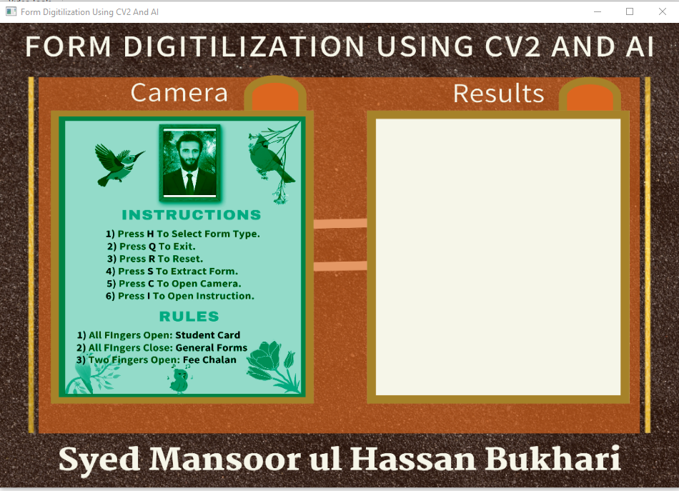
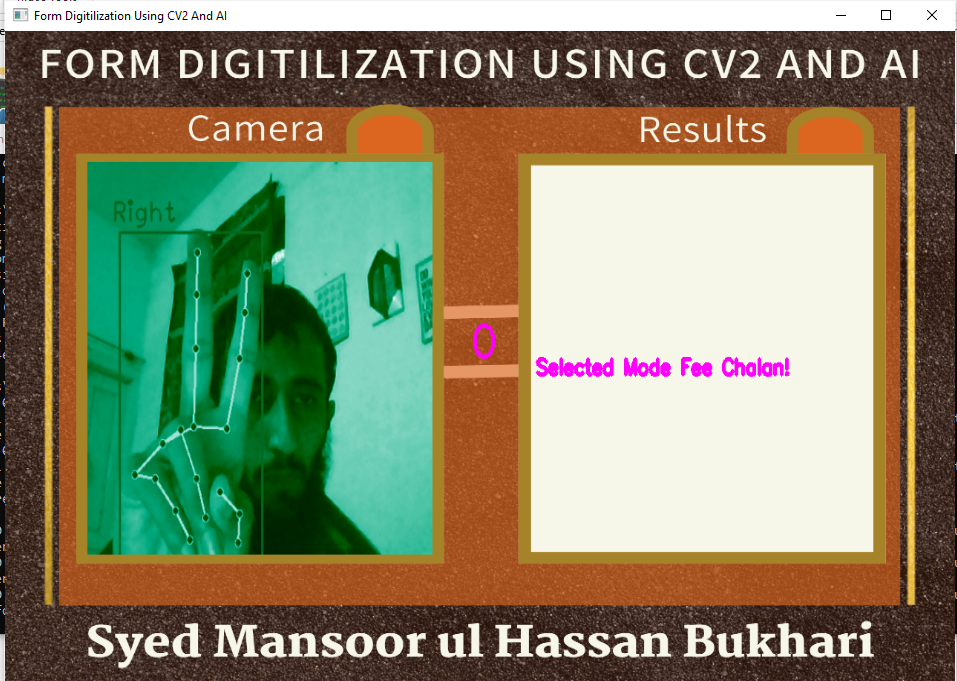
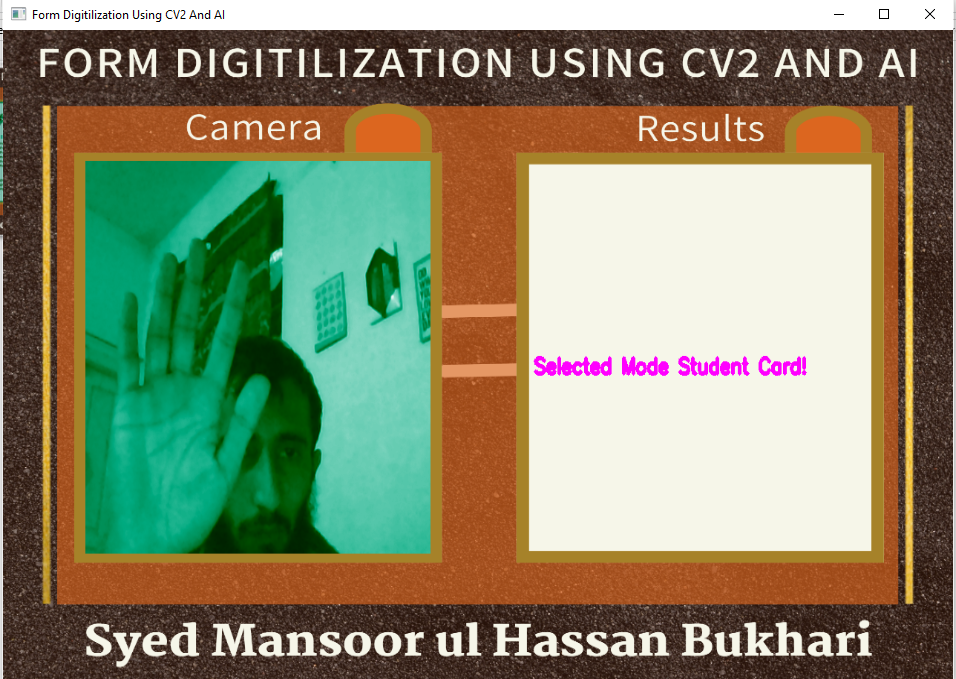
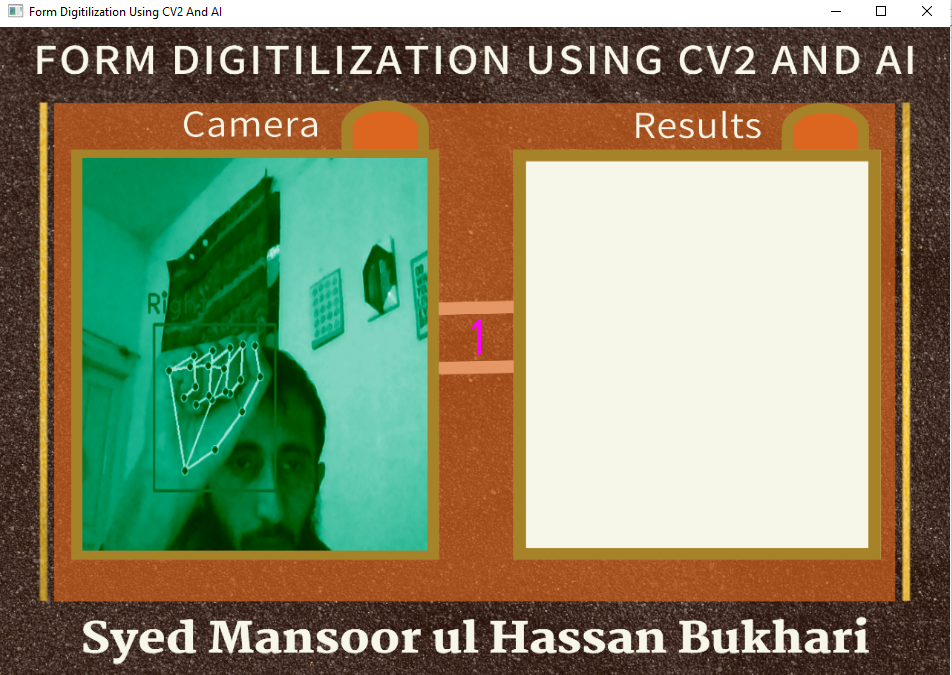
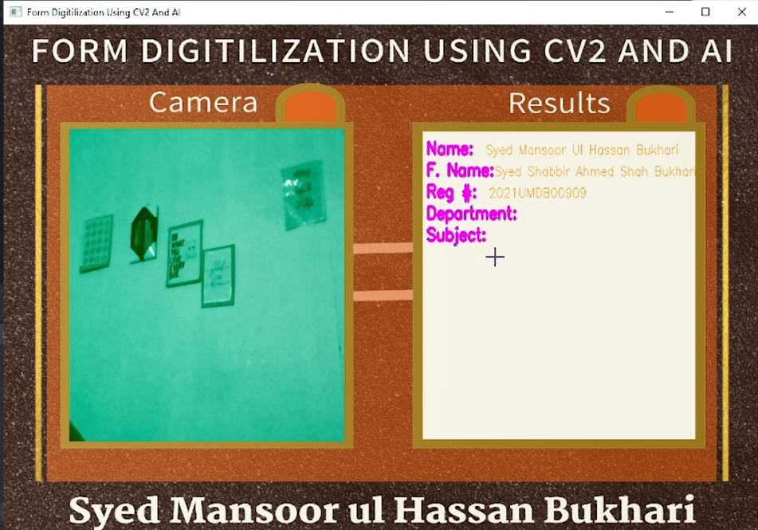
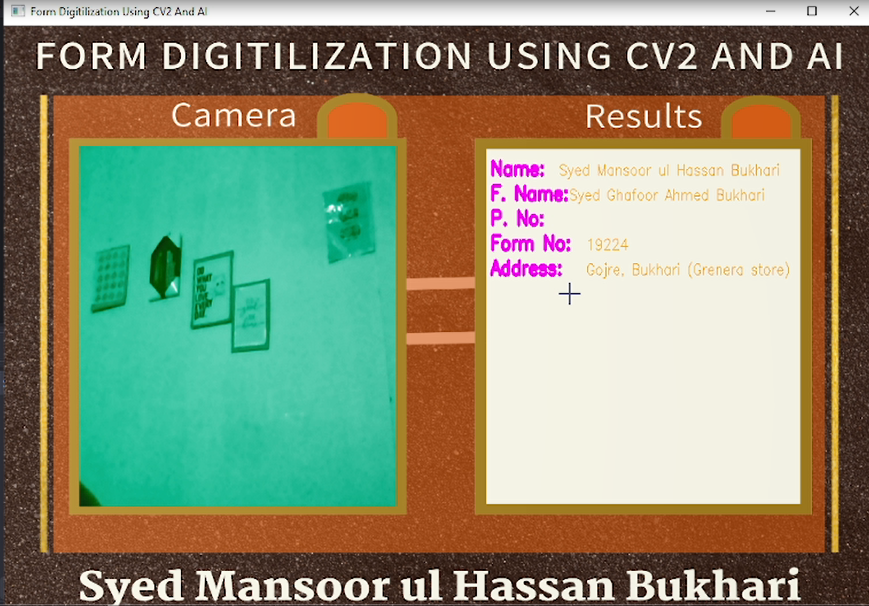

# Form Digitization Using CV2 and AI 🎥🤖

This project leverages OpenCV and the **Gemini 1.5 Flash API** for real-time form digitization. It provides an interactive interface to digitize forms, detect hand gestures for form type selection, and overlay extracted data on a visually appealing custom background.

## Features 🌟
- **Real-Time Video Feed:** Captures live input from the webcam.
- **Hand Gesture Recognition:** Uses finger gestures to select the form type (e.g., Student Card, Challan, General Form).
- **Gemini 1.5 Flash API Integration:** Extracts text from images of forms uploaded by the user.
- **Dynamic Data Display:** Displays extracted data (like name, CNIC, department, etc.) directly on the application interface.
- **Customizable UI:** Implements a styled UI with background overlays and region-specific displays.
- **Video Recording:** Allows recording of sessions for future reference.
- **Multi-Mode Support:** Toggle between instruction view, live capture, and extracted text view.

---

## Prerequisites 📋
Make sure you have the following installed and set up before running the application:

- **Python 3.8+**
- **OpenCV** (`cv2`)
- **cvzone** (for hand gesture detection)
- **Pillow** (for image processing)
- **Gemini 1.5 Flash API** credentials
- A webcam for live video input

---

## Installation 🛠️
1. Clone the repository:
   ```bash
   git clone https://github.com/cyberfantics/form_digitilization.git
   cd form_digitilization
    ```
2. Install the required dependencies:
    ```
    pip install -r requirements.txt
    ```
3. Add your `Gemini 1.5 Flash API` key in the `extract.py` script.

---

## How to Use ▶️

### Run the application:
```bash
python main.py
```
### Follow the On-Screen Instructions 📋

- **Press `p`**: Toggle video recording.  
- **Press `i`**: View the instructions screen.  
- **Press `c`**: Enter live capture mode.  
- **Press `s`**: Send the frame to the Gemini 1.5 Flash API for text extraction.  
- **Press `h`**: Activate hand gesture detection for form type selection.  
- **Press `q`**: Exit the application.  

---

## Hand Gesture Rules ✋

- **Five fingers open**: Select **General Form Mode**.  
- **Two fingers open (peace sign)**: Select **Fee Challan Mode**.  
- **Five fingers closed (fist)**: Select **Student Card Mode**.  

---

## Output 📊

- The extracted data (e.g., **Name**, **CNIC**, **Gender**) is displayed directly on the UI.  
- You can view the processed data in live video frames and save the session as a video file.  

---

## File Structure 📂

- **`main.py`**: Core application logic.  
- **`extract.py`**: Contains API integration for text extraction.  
- **`resources/`**: Contains images for the UI (e.g., background and instructions).  
- **`requirements.txt`**: List of dependencies.  

---

## Screenshots 📸
<div style="display: flex; justify-content: space-between;">
  
  
  
</div>

<div style="display: flex; justify-content: space-between;">
  
  
  
</div>

---

## Contributing 🤝

Contributions are welcome! Feel free to submit a pull request or open an issue to suggest improvements.

---

## License 📜

This project is licensed under the **MIT License**.

---

## Author
**Syed Mansoor ul Hassan Bukhari**  
[GitHub](https://github.com/cyberfantics) | [LinkedIn](https://www.linkedin.com/in/mansoor-bukhari/)

---
### **Happy Digitizing!** 🎉